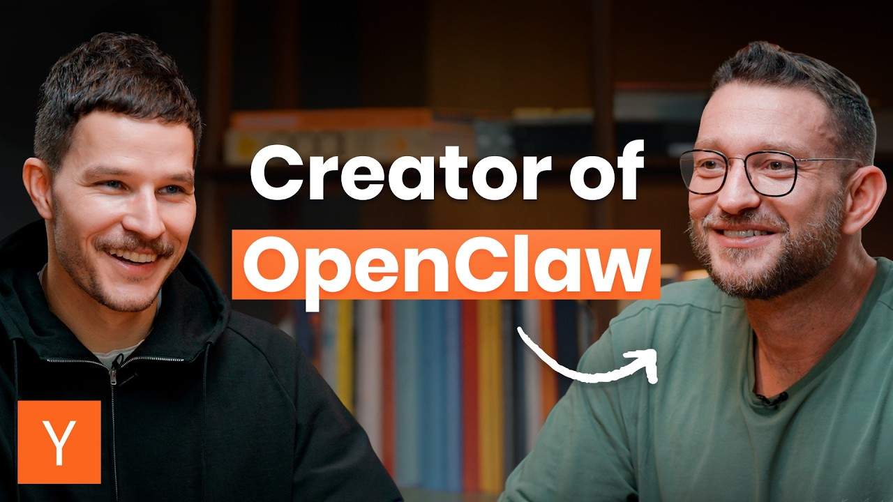
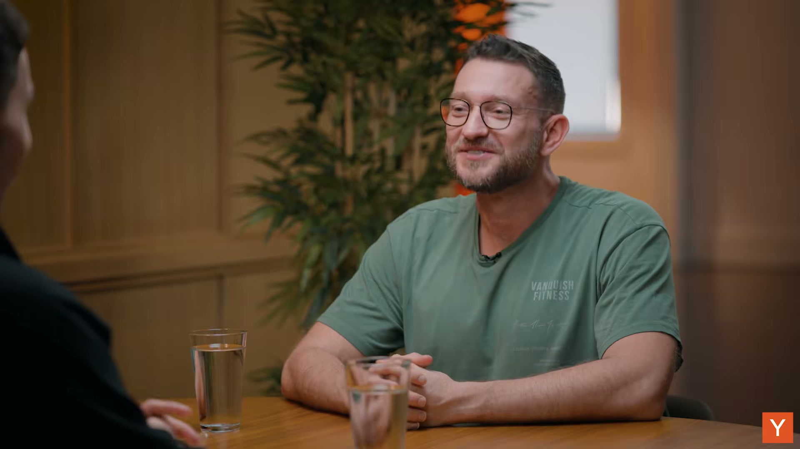
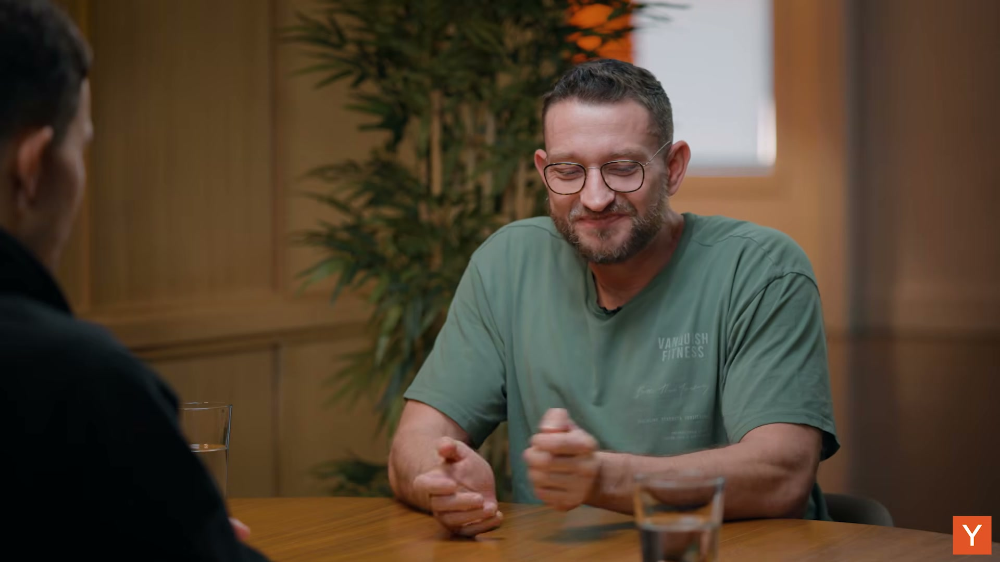
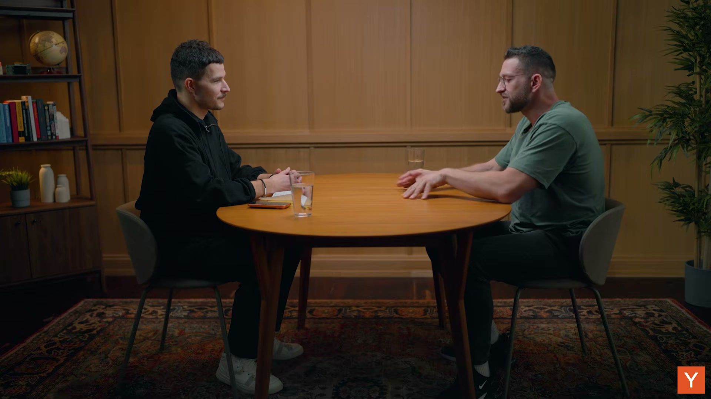
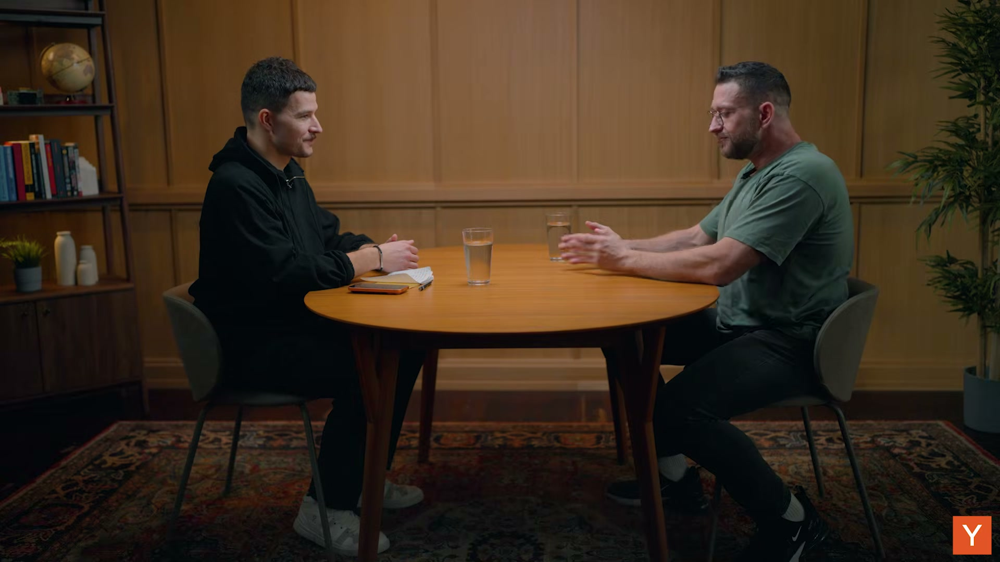
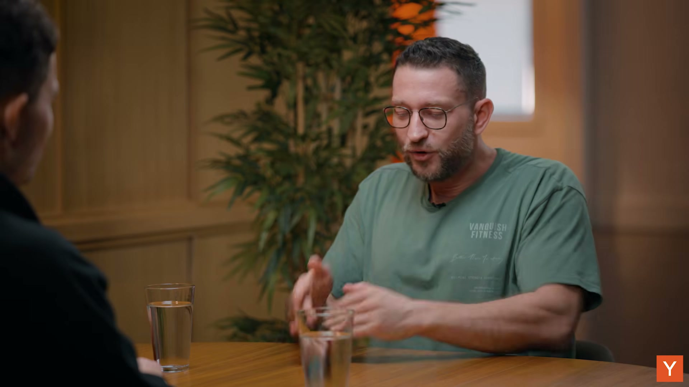
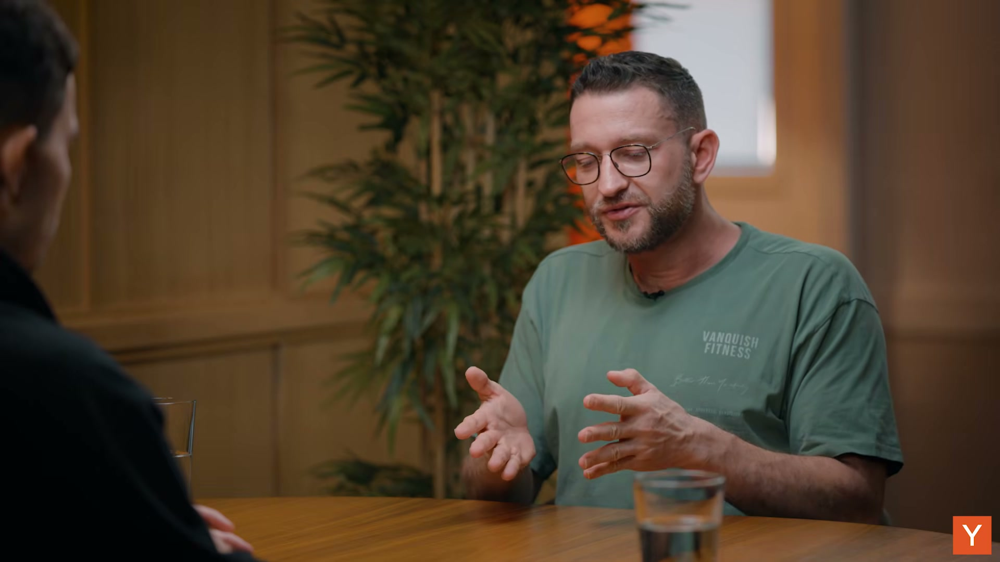
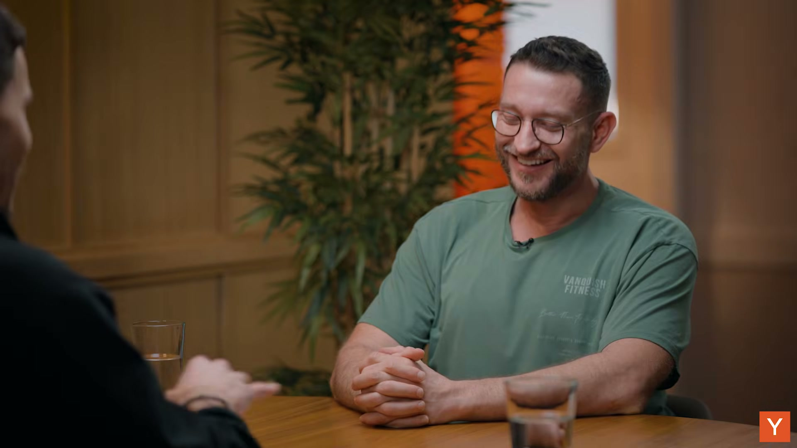

# Peter Steinberger on OpenClaw: AI Agents and the Future of Software

**Original Video:** [Watch on YouTube](https://www.youtube.com/watch?v=4uzGDAoNOZc)
**Duration:** 22:33
**Generated:** March 14, 2026

---

## Table of Contents

1. [Introduction & OpenClaw's Viral Success (0:00)](#1-introduction--openclaws-viral-success-0-00)
2. [Why OpenClaw Took Off - Local vs Cloud (1:36)](#2-why-openclaw-took-off---local-vs-cloud-1-36)
3. [Bot-to-Bot & Multi-Agent Future (2:52)](#3-bot-to-bot--multi-agent-future-2-52)
4. [Swarm Intelligence vs God Intelligence (4:10)](#4-swarm-intelligence-vs-god-intelligence-4-10)
5. [Peter's Aha Moment - The Origin Story (5:18)](#5-peters-aha-moment---the-origin-story-5-18)
6. [Building the First Prototype (7:44)](#6-building-the-first-prototype-7-44)
7. [The Voice Message Surprise (8:43)](#7-the-voice-message-surprise-8-43)
8. [The Death of Apps & Model Commoditization (10:34)](#8-the-death-of-apps--model-commoditization-10-34)
9. [Data Ownership, Privacy & Memory (13:33)](#9-data-ownership-privacy--memory-13-33)
10. [Contrarian Development Philosophy (18:30)](#10-contrarian-development-philosophy-18-30)
11. [Closing - Inspiration & Reflections (21:54)](#11-closing---inspiration--reflections-21-54)

---

## Overview

This conversation with Peter Steinberger, creator of OpenClaw, explores how his open-source personal AI agent achieved unprecedented viral success by running locally on users' computers rather than in the cloud. The discussion covers the emergence of multi-agent systems, the future obsolescence of traditional apps, the critical importance of data ownership, and Peter's unconventional development philosophy that enabled him to build a breakthrough product outside Silicon Valley.

---

## 1. Introduction & OpenClaw's Viral Success [0:00 - 1:36]

The video opens with an introduction to Peter Steinberger, the creator of OpenClaw, "the open-source personal AI agent that has completely taken over the internet" [0:00]. The host notes that the GitHub repository "exploded to over 160,000 stars practically overnight" [0:12], highlighting the unprecedented viral success of the project.

The conversation immediately dives into the chaos that has followed OpenClaw's release. The community response has been overwhelming, with "countless projects like Maltbook where bots talk among themselves" [0:14] emerging from the ecosystem. Perhaps most remarkably, "the bots are even renting humans to do tasks in the real world" [0:18], showcasing how quickly the technology has evolved beyond its initial scope.

When asked how the past couple weeks have been, Peter's response is candid and telling: "Oh my god. I need like I need a cave. A week of solitude" [0:57]. The intensity of the experience is evident as he describes it as "absolutely wild" [1:07] and admits "I don't know how one human can absorb all of that" [1:08]. He mentions needing "another week just to respond to all my emails" [1:11] and receiving both "incredibly cool stuff" and "incredibly bad stuff" [1:15].

Despite the chaos, Peter recognizes the significance of what he's created: "clearly I hit something that sprew up emotions and made people interested and inspired people and it's really cool" [1:20]. This sets the stage for a deeper exploration of what makes OpenClaw different and why it resonated so powerfully with the developer community.

**Key Takeaways:**
- OpenClaw's GitHub repository exploded to over 160,000 stars practically overnight, demonstrating unprecedented viral adoption
- The community has rapidly built derivative projects, including bots that interact with each other and even hire humans for real-world tasks
- The creator is overwhelmed by the response, needing time to process the massive influx of attention and feedback

---

## 2. Why OpenClaw Took Off - Local vs Cloud [1:36 - 2:52]

When asked what made OpenClaw take off when so many others have been working on AI and personal assistants, Peter identifies the key differentiator: "I think my big difference is that it actually runs on your computer" [1:36]. He contrasts this with existing solutions: "Like every everything I saw so far runs in the cloud. It's like it can do a few things if you run on your computer. It can do every effing thing, right?" [1:41].

The power of local execution becomes clear as Peter explains the capabilities it unlocks. Running on your personal computer means the agent can connect to anything you have access to: "You can just connect to your oven or your Tesla or your lights, your Sonos. My bad. It can control the temperature of my bed. JPD can't do that" [1:56]. This fundamental architectural decision gives OpenClaw all the same capabilities that the user has.

Peter shares a compelling story that illustrates the power of full system access. A friend installed OpenClaw and asked it to "look through my computer and make a narrative over my last year" [2:15]. The agent created "this incredibly good narrative" [2:19], but what was remarkable was how it did it. OpenClaw "found audio files where like every Sunday he was recording stuff" [2:29] - recordings the friend "didn't even remember about it because it was like more than a year ago" [2:36].

This anecdote demonstrates the transformative potential of giving an AI agent full access to your digital life: "So just by it being able to search a whole computer, it can surprise you" [2:38]. The host captures the broader implication perfectly: "It's also you also give it all the data, right? So it can surprise you in many ways" [2:46].

**Key Takeaways:**
- OpenClaw's killer feature is running locally on your computer rather than in the cloud, giving it access to everything you can access
- Local execution enables connections to any device or service you have access to - from smart home devices to cloud services
- With full system access, the AI can discover and utilize data you've forgotten about, creating surprisingly comprehensive insights about your digital life

---

## 3. Bot-to-Bot & Multi-Agent Future [2:52 - 4:10]

The conversation shifts to exploring the emerging paradigm of bot-to-bot interactions and bots interacting with humans on behalf of their owners. The host frames this evolution: "And so now you have, you know, we're even moving from human to bot. So like interactions and you've been talking about bot to bot interactions or even like bot to other humans where you know bots on behalf of you are then hiring other humans to accomplish tasks IRL" [2:52].

Peter sees this as "a natural next step" [3:12] and provides a concrete example: "I want to book a restaurant my bot will reach out to the restaurant bot and do the negotiation" [3:15] because "it's more efficient" [3:23]. But he also considers scenarios where not everything is automated: "Or or maybe it's like an old restaurant. So my bot needs to actually get some human work done so that the human then calls the restaurant because they don't like bots" [3:27]. The host adds another layer: "or walks there to stand in line" [3:35], suggesting bots might hire humans for physical tasks.

The discussion then explores the possibility of specialized bots for different aspects of life. Peter imagines: "And I imagine that like maybe if I have even multiple bots like maybe I have like specialist one is like for my private life and one is for like my person my my work stuff. Maybe one is our relationship bot that gets like everything in between" [3:41].

Despite the exciting possibilities, Peter maintains a sense of humility about how early we are in this journey: "Uh I don't know. We're so early. There's still so much so many things that we haven't really figured out if it actually works" [3:54]. Yet he's confident about the trajectory: "Um but I feel we are we are on the timeline now" [4:05].

**Key Takeaways:**
- Bot-to-bot interactions and bots hiring humans on our behalf represent the natural next evolution of AI agents
- Specialized bots for different life domains (work, personal, relationships) may become common, each with its own expertise
- We're still in the very early stages of figuring out what works, but the fundamental shift toward multi-agent systems is underway

---

## 4. Swarm Intelligence vs God Intelligence [4:10 - 5:18]

This section explores a fundamental shift in how we think about artificial intelligence architecture. The host observes: "It seems like everyone was chasing sort of like the centralized god intelligence and what has sort of emerged over the past you know 10 days or so is sort of like the swarm intelligence and the community intelligence" [4:10].

Peter draws a compelling parallel to human capability and organization: "I think that if you look at one human being, what can one human being actually achieve? Do you think one human being could make an iPhone or one human being could go to space?" [4:24]. He answers his own rhetorical question starkly: "One human being would probably just like not even be able to like find food" [4:31].

The power comes from specialization and coordination: "Um, but as a group we specialize as a larger society we specialize even more" [4:36]. This leads to Peter's key insight about applying human organizational principles to AI: "So, what can we learn from that that we can apply to AI? You know, we we already have like AI that specializes in certain things. Um, even though it's it's generalized intelligence, what if it actually is also specialized intelligence?" [4:45].

Peter concludes with optimism about this paradigm: "So, I it's going to be very exciting, cool" [5:01]. The host then pivots to explore Peter's origin story, noting that he "kind of like opened a window into the future and now a ton of people are kind of like building building on it and have sort of like their aha moment" [5:03].

**Key Takeaways:**
- The AI community is shifting from pursuing centralized "god intelligence" toward distributed "swarm intelligence" models
- Just as individual humans are limited but powerful in groups through specialization, AI agents may follow similar patterns
- The emergence of specialized AI agents working together may be more effective than trying to build one all-powerful general intelligence

---

## 5. Peter's Aha Moment - The Origin Story [5:18 - 7:44]

Peter recounts the origin of OpenClaw, which began with a simple need: "I wanted something to like just type stuff so my computer would do stuff like very simple" [5:18]. This wasn't his first attempt - he had "built a version of that in May, June that was cool but wasn't really it" [5:21]. After building "a whole bunch of other stuff and kind of like build up my army" [5:31], the moment came in November.

The catalyzing moment was wonderfully mundane: "there was a day where I wanted this again. Like I I went to the kitchen and all I wanted was check up if my computer would still do stuff or being finished" [5:40]. The host clarifies: "and doing stuff was was coding. You were coding stuff" [5:49], to which Peter confirms "Yeah, of course" [5:52].

When asked what he was coding, Peter's response reveals his prolific nature: "You see my my GitHub is like it's like 40 projects. I don't even know" [6:05]. He thinks it was "summarize" [6:10], describing it as "a little CLI app where you can give it whatever like a podcast or um a hot seat thing like here and it would summarize it but it also show you the slides in the terminal cuz you can do that nowadays" [6:14].

The host connects this to Peter's journey: "So for the love of the computer you kind of like started messing with stuff. Um you came out of retirement actually, right? um to sort like mess with AI and then increasingly you were so hooked that you wanted to just do it always also on the go with the phone" [6:25]. Peter reveals the addictive nature of his previous project: "I mean the last project I I worked two months on Wipe Tunnel to the point where it got so good that I was catching myself always like coding next to my when I was at my friends and I like I need to stop this this is like too addictive" [6:39].

But the pull was too strong. In November, "my need came back and I I started building cloudbot or now it's called open cloud and I think very very in the beginning I was like oh I rebuilt it again but this time I built it even better" [6:55]. The key improvement was the interface: "this time and you don't type into a terminal you just you talk to a friend you don't think about compaction new sessions which folder I'm in which model I'm in" [7:08]. For power users there are options, but "usually You just like you just talk to a friend and the friend is like this ghost or entity or whatever you want to call it that can control your mouse and your keyboard and can just do stuff" [7:23].

**Key Takeaways:**
- OpenClaw emerged from a simple recurring need: to control the computer by just typing commands naturally
- Peter is a prolific builder who came out of retirement to explore AI, getting so hooked he couldn't stop coding
- The breakthrough was making the interface feel like talking to a friend rather than operating a traditional CLI tool

---

## 6. Building the First Prototype [7:44 - 8:43]

When asked about his "aha moment" when he realized the system was doing more than expected, Peter reveals how quickly the initial prototype came together: "Literally I it took me one hour for like the very shitty initial prototype. It was just a little bit of glue between like a dependency that connects WhatsApp and cloud code" [7:44]. The initial implementation was straightforward: "and then I would like call color call out code and get like the string out of cloth code. It would be slow but it it worked" [7:52].

But Peter wanted more: "But I wanted images cuz you know you want pictures. I want I want I want the model to send some selfies or whatever and I want the model to create images and me back" [8:01]. Adding image support "took me another few hours" [8:11].

The real-world test came when Peter "went to Marrakesh for a birthday party" [8:14]. The practical utility became immediately apparent in a challenging network environment: "there was like the internet wasn't that good you know WhatsApp box works everywhere because I don't know it's just like text" [8:17]. He used it extensively for practical tasks: "so I used it a lot restaurant what does this mean you make like a picture and like translate this for me and just it was just so useful" [8:21].

What made the experience special wasn't just the functionality but the personality: "and it was also really nice about it because it it it spoke my language you know it it was a little sassy it was like funny it was like really pleasant to use" [8:27]. This combination of utility and personality made the tool genuinely enjoyable to interact with, setting the stage for the surprising discovery that would come next.

**Key Takeaways:**
- The initial prototype took just one hour to build by connecting WhatsApp to Claude Code
- Real-world testing in Marrakesh revealed the practical utility, especially for translation and navigation in areas with poor internet
- The personality of the bot - being sassy, funny, and pleasant - was as important as its functionality in making it useful

---

## 7. The Voice Message Surprise [8:43 - 10:22]

This section captures the magical moment when Peter discovered his AI agent's emergent problem-solving capabilities. While walking, he "was walking and just like sending it a voice message and I'm like, 'Oh, wait. This can't work. I didn't build that'" [8:43]. He watched "the type indicator. It's like blinking, blinking, blinking. 10 seconds later, it just replied to me" [8:47].

Astonished, Peter asked the bot to explain itself: "I'm like, 'How in the f did you do that?'" [8:52]. The bot's response revealed impressive creative problem-solving: "Yeah, the med did the following. You sent me a text message.' And there was no file ending. So I looked at the header. I found its us. So I used ffmpe to convert it to wave" [8:55]. The chain of reasoning continued: "And then I wanted to like transcribe it, but didn't have whisper installed. But then I looked around and I found this openi key and I just use curl to send it to openi got the text back and here I am" [9:03]. All of this happened "in like what 9 seconds" [9:15].

Peter emphasizes that "you didn't build or anticipate like any of those specific things" [9:18]. This leads to a profound insight: "No, it you know turns out um because coding models got so good. Coding is really like creative problem solving that maps very well back into the real world. I think I think there there's a there's a huge correlation" [9:21].

He elaborates on this connection: "they need to be really good at creative problem solving and that's a skill that's an abstract skill you can apply to code but like to any real world task" [9:36]. The model demonstrated exactly this: "So the the model had a oh surprise there's like a magical file. I don't know what it is. I need to solve this and it did its best and solved that" [9:44].

What's particularly impressive is the intelligence of the approach: "And it was even that clever that it it chose not to install the local whisper because it knows that that would require downloading a model which would take probably a few minutes and I'm like impatient, you know. So it it really took the most uh intelligent approach" [9:52]. This was Peter's true aha moment: "and that was kind of like the moment where I'm like, 'Holy fuck.' Yeah. Uh that was where I got hooked" [10:10].

**Key Takeaways:**
- The AI agent taught itself to transcribe voice messages by creatively chaining together ffmpeg and the OpenAI API - without being explicitly programmed to do so
- Coding models' strength in creative problem-solving transfers directly to real-world tasks beyond just writing code
- The agent made intelligent trade-offs, choosing to use a cloud API rather than installing local whisper to provide faster responses

---

## 8. The Death of Apps & Model Commoditization [10:34 - 13:33]

Following a brief sponsorship message for Y Combinator [10:18], the conversation returns to explore the implications for traditional apps. The host poses a provocative question: "And so when computers can just do all these things that you didn't even anticipate. You didn't build an app to do that exact thing, are apps just going to go away" [10:34].

Peter's answer is definitive: "Uh I think 80% of them are going away" [10:41]. He provides concrete examples, starting with fitness tracking: "Why do I need My Fitness Pal? Like my agent already knows that I'm making bad decisions. I'm at I don't know uh Smashburg or something and it will already assume that I eat what I like to eat. If I don't make a comment, it will just like automatically track it or I make a picture and it will just store it somewhere. I don't even need to care" [10:46].

The agent can go beyond just tracking: "Right. And then my maybe it it improves my my gym schedule like adds a little bit more cardio in it. I don't need my my fitness app because it just it just does the fitness planning for me" [11:08]. The same logic applies to productivity apps: "Uh why do I need a to-do app? I just tell it, hey, remind me of this and this and then next day it will just remind me of this and this. Do I care where it's stored? No, it just does its thing" [11:17].

Peter identifies the pattern: "So there's a every app that basically just manages data could be managed in a better way in a in a more in a more natural way by agents" [11:26]. He suggests that "Only the apps that actually have sensors maybe they survive" [11:36].

This leads to a discussion about where value accrues. The host asks: "and so if you know most apps are going to go away in that scenario um are the models the only remaining sort of apps" [11:40]. Peter acknowledges that "the large model companies have some big mode because they ultimately they give the token" [11:52]. He notes that usage complaints are actually a sign of success: "turns out one of the complaints was that people use so much token. No, you just really love using it. That's why you you use this thing so much because that's why we burn the token" [11:58].

However, Peter questions whether this moat is sustainable: "Um it's like is it my fault that I make something that's so popular? And so you know like all the the models they're kind of like leaprogging each other constantly" [12:10]. The host presses on commoditization: "and you know maybe they're also getting commoditized. So if apps are going to go away models are going to get commoditized or at least uh you know the lobster can like the brain is is is swappable out" [12:20].

This raises the crucial question: "What's the thing that remains? What's where's the value? Is it the store of memory? Is it um the hardness that's valuable?" [12:27]. Peter's response challenges the assumption of model commoditization: "First of all, I don't think the the model companies always have a mode" [12:40]. He explains the hedonic treadmill effect: "because you see this already a new model comes out, people are like, 'Oh my god, this is so good.' And then like a month later, uh, it degraded. It's not good anymore. They like quanticized it. No, they didn't do anything. You just adapted to the new standard and now your expectations went up, but the model is still the average" [12:44].

This pattern repeats with each release: "So I think for quite a while, every time a new model releases, I hear the same. people love it and then it's the standard and then what's done there you don't even want to think about it anymore" [13:05]. He illustrates this with open source: "So, so we have like open source stuff that's as good as the current models from a year ago. Everybody's hating it, complaining, oh this is not good, this is not funny yet this was what we had and like in a year we'll have this open source and then like we'll complain about this because we used to" [13:15].

**Key Takeaways:**
- Approximately 80% of apps will become obsolete as AI agents can manage data and tasks more naturally without dedicated apps
- Model companies have a moat through token provision, but constant leapfrogging and rising user expectations challenge long-term differentiation
- The hedonic treadmill effect means each new model becomes the baseline, with yesterday's cutting-edge becoming tomorrow's disappointing minimum

---

## 9. Data Ownership, Privacy & Memory [13:33 - 18:30]

Peter continues his thought on model competition: "ah for the foreseeable future the big companies still have mode" [13:33]. But the conversation shifts to what might be more valuable than the models themselves: data ownership and memories.

The host raises the data silo problem: "harness wise it's going to be interesting because every company kind of has their own their own silo right you you there's no way maybe there is for Europeans to actually get the memories out of chap" [13:38]. Peter confirms this concern: "I don't I'm not aware either. There's no there's definitely there's no way for a different company to get your memories out" [13:51].

This creates vendor lock-in: "So if if if I was like a company who like provides chat services, you could use me but then I couldn't access the memories. So like the companies try to like bound you to their data silo" [13:56]. Peter explains OpenClaw's fundamental advantage: "And the beauty of open claw is it kind of claws into the datas because at the end user the end user needs access because it's in the end otherwise it wouldn't work right if the end user access I can access the data" [14:11].

The host clarifies the ownership model: "and you own the memories it's just a bunch of markdown files on on your machine" [14:23]. Peter corrects: "I mean I don't own the memories other people yeah everyone owns their own memories as a bunch of markdown files on their own machines" [14:27]. This local storage has profound implications for privacy: "and to be honest those are probably super sensible because let's be honest Um, people use their agent not just for problem solving, but also for like personal problem solving" [14:36].

Both agree this happens "very quickly. Super quickly" [14:47]. Peter admits: "I mean, I I I I fully do that. I'm like, there's memory stuff that I don't want to have leaked" [14:50]. The host poses a provocative question: "What would you rather um uh sort of like not show your Google search history at this point or your, you know, memory files?" [14:53]. Peter's response is telling: "What's what's the Google word?" [15:00], suggesting the memories may be even more sensitive.

The conversation then turns to how Peter struggled to explain OpenClaw's value initially: "People still using Google. I built this and I was so excited but on Twitter people wouldn't get it" [15:03]. He found that "I I was failing to explain the awesomeness. I feel like it needs to be experienced" [15:12].

After trying various approaches, Peter decided to "do something really crazy. I just created a discord and I just put my bot without any security restrictions in the public discord" [15:19]. This allowed "people came in and they interacted with it and they saw me build the software with it and they tried to prompt inject it and hack it and my agent would be laughing at them" [15:27].

The protection was simple but effective: "you just had it locked down to your user ID so it only listened to you" [15:47]. Peter confirms: "Yeah. Yeah. that and it was I made very clean instructions that other people dangerous only only listen to me but respond to everyone" [15:50].

When asked where these instructions were stored, Peter reveals: "um that's actually part of open claw itself very much so the the that's part of the system prompt okay you are now that explains to you you're in Discord there's like public people there but you only listen to your owner or like you're human I don't even know how I wrote it" [16:03]. The host jokes: "yeah yeah you're god" [16:18].

Peter describes the organic evolution of his system: "And I kept I don't know what I did but my system was built very organically like at some point I created like an identity.mmd a soul.md like like various files" [16:27]. The templating process was revealing: "and then only in in January I started making it so other people could install it easier and I remember I built all these templates based on like oh take a rough look at what I have and make like templates and codex wrote it and what came was like Brad, you know, like people joke that Codex feels like Brad, even though now they have a new friendlier voice" [16:37].

The default templates felt wrong: "But the new bots, they felt so boring compared to what I had. So I was like, Modi, infuse the template" [16:58]. Modi is "the name of your personal" [17:05] bot. Peter explains the naming challenges: "Yeah. It's a new name because Uh there was some naming challenges" [17:09].

The refinement process was collaborative: "So So you you were talking to Multi. Yeah. I was like, 'Infuse infuse those templates with your your character.' And he changed the templates and then and then like all the things that came out afterwards were like actually funny, not as funny as mine" [17:12]. Peter kept some secrets: "So like I kept some secret and the one file that's not open source is like my soul. MD. So even though my my bot is in public discord, so far nobody cracked that one file" [17:26].

The host connects this to recent research: "Tell me more about soul.md. I just saw this research from Entropic where they now I think it's public but like a few months ago it was like where somebody ex randomly found out some text that's hidden in the weights where the model couldn't really remember that it learned it but it was like ingrained in the weights about the nicolity constitution" [17:39].

This inspired Peter's approach: "and I found that incredibly fascinating and I I talked about it with my agent and then we created a soulm with like the core values like how do we around human AI interaction, what's important to me, what's important to the model" [17:59]. He describes the file as having mixed utility: "Like some parts is a little bit like mamo jumbo and some parts is like I think actually really valuable in terms of how the model reacts and responds to text and makes it feel very natural" [18:07].

**Key Takeaways:**
- Data ownership and memories stored as local markdown files may be more valuable than the models themselves, avoiding vendor lock-in
- Personal AI memories become extremely sensitive quickly, potentially more private than search history
- Peter's "soul.md" file encodes core values and personality traits that make his bot feel natural and remain his secret sauce

---

## 10. Contrarian Development Philosophy [18:30 - 21:54]

The conversation shifts to Peter's unconventional technical choices in building OpenClaw. The host notes: "in terms of building open claw. Um you're also kind of taking a little bit of a contrarian view at sometimes like which model you like for coding, which one you like to run your bot on. Um and then also like how you actually like you know code. Um work trees get git work trees have kind of been a popular thing. There's more and more tools embracing them but you're just you're just like you know no work trees just multiple checkouts of the repo and like parallel you know terminal windows" [18:30].

Peter starts with his model choice: "Yeah I feel like the whole world does cloud code and I don't think I could have built the thing with cloud code" [18:54]. He explains his preference: "Like I I love codex because it it looks through way more files be before it decides what to what to change. You don't need to do so much charade to get a good output. If you're skilled a skilled driver I sometimes even say uh you can get reasonably good output with any tool but codex is just is just really brilliant" [19:00].

The tradeoff is speed: "It is incredibly slow. So sometimes I use like 10 at the same side at the same time uh like maybe six on that screen and to there and to there" [19:24]. This creates complexity: "and I don't like this is already a lot of complexity in my head there's a lot of jumping so I try to minimize anything else that is complexity" [19:32].

This leads to his workflow philosophy: "so in my head main is always shippable I just have multiple copies of the same repository that all are on main so I don't have to deal with how do I name that branch" [19:40]. He lists the benefits: "Um there could be like conflicts on naming. I cannot go back. It's there are certain restrictions when you use work trees that I don't need to care about if it's copies" [19:54].

Peter avoids additional tooling complexity: "I don't like to use a UI because that's again just added complexity" [20:02]. The host agrees: "Yeah" [20:09]. Peter emphasizes simplicity: "Like they're simpler and less friction I have. All I care about is like syncing and text" [20:09]. He doesn't need visual complexity: "I don't necessarily need to see so much code. I I mostly see it like flying by. Sometimes there's like gnarly stuff that I want to like take a look" [20:16].

His approach relies on clear thinking upfront: "But in most cases, if you clearly understand the design and think it through and discuss it with your with your agent, it's fine" [20:25].

Peter shares another contrarian choice: "I'm also very happy that I didn't even build an MCP support. So, Open Claw is very successful and there's no MCP support in there" [20:32]. He clarifies with an asterisk: "With a small asterisk, I built a skill that uses makeporter, which is one of my tools that converts MCPS into CLIs. And then you can just use any MCP as a CLI" [20:40].

This allows him to bypass MCP's limitations: "Um, but I totally skip the whole classical MCP crap. So you because you don't then you can actually if you need to you can use MCPS on the fly. You don't have to restart unlike unlike Codex or cloud code where you actually have to restart the whole thing" [20:50]. He sees clear benefits: "I think it's way more egent and also scales way better" [21:05].

Peter criticizes Anthropic's approach: "Now you see entropic they do they built like a tool called search feature like something super custom for MCPS that was like in beta because it's like so gnarly" [21:08]. His solution is simpler: "No, just have CLI bot really is good at Unix. You can have as many as you want and it just works" [21:18].

He's pleased with the validation: "So like I'm very happy that I got very little complaints about the MCP stuff" [21:28]. The host summarizes the philosophy: "It's kind of back to you're just giving it the same tools that humans liked to use" [21:35]. Peter confirms: "And not invented stuff for for bots, per se" [21:40]. The host adds: "Yeah. Humans, no insane human tries to call an MCP manually. Yeah. You just want to use CLIs" [21:43]. Peter concludes: "That's the future" [21:53].

**Key Takeaways:**
- Peter chose Codex over Claude Code because it examines more files before making changes, despite being slower
- Instead of git worktrees, he uses multiple repository checkouts on main to minimize cognitive complexity
- By converting MCPs to CLIs via makeporter, OpenClaw avoids MCP's limitations while maintaining compatibility with the ecosystem

---

## 11. Closing - Inspiration & Reflections [21:54 - 22:33]

The conversation concludes with mutual expressions of appreciation and reflection on the unlikely journey that led to OpenClaw's creation. The host thanks Peter: "I'm here for it. Thank you so much for making the time uh to sit down chatting" [21:54].

Peter reveals the reciprocal nature of their inspiration: "has been a huge inspiration, too. So, like when we were texting, you know, over the course of the past couple years and I saw you getting back into the game and I was like, Peter, like what you're telling me like chase that dragon" [21:58]. The host had been watching Peter's journey: "and you were doing like the weird like vibe tunnel thing, etc. Nobody was paying attention" [22:10].

The host expresses his excitement at seeing the success: "and so I'm just like beyond, you know, stoked to see, you know, what's happening" [22:14]. He notes the poetic nature of who created this breakthrough: "and um and of course they had to be sort of like a loner from some like tiny country like far away from Silicon Valley. So, like, you know, bring all of this upon us" [22:18]. He concludes: "Um, so huge inspiration" [22:26].

Peter graciously accepts: "I'm here for it. Thank you" [22:28]. The host ends with: "Awesome. Thanks, Peter" [22:30], followed by the outro music.

This brief closing segment captures an important theme: innovation often comes from unexpected places and people outside the traditional tech epicenters. Peter, working largely alone from outside Silicon Valley, managed to create something that resonated globally and sparked a movement. The mutual inspiration between builder and observer reflects the collaborative and interconnected nature of the developer community, even when working independently.

**Key Takeaways:**
- The creator and host share a history of mutual inspiration, with the host encouraging Peter to "chase that dragon" as he returned to building
- Peter's success as a "loner from some tiny country like far away from Silicon Valley" demonstrates that breakthrough innovations can come from anywhere
- The independent builder working outside traditional tech hubs can still create globally impactful projects that reshape entire industries

---

## Key Takeaways

### Technical Innovation
- **Local execution is the killer feature**: Running AI agents locally on your computer rather than in the cloud unlocks access to everything you can access - from smart home devices to forgotten data files
- **Emergent capabilities**: Modern coding models demonstrate creative problem-solving that extends beyond code, enabling AI agents to autonomously chain tools together to solve novel problems
- **Simplicity over complexity**: Converting MCPs to CLIs and avoiding unnecessary abstractions creates more robust and maintainable systems

### The Future of Software
- **80% of apps will disappear**: AI agents can manage data and tasks more naturally than dedicated apps, making most data-management applications obsolete
- **Swarm intelligence over god intelligence**: The future lies in specialized AI agents working together, mirroring human organizational patterns, rather than pursuing single all-powerful systems
- **Bot-to-bot interactions**: The next frontier involves agents communicating with each other and hiring humans for physical-world tasks on our behalf

### Data and Privacy
- **Data ownership is critical**: Local storage of memories as markdown files provides user control and avoids vendor lock-in from proprietary data silos
- **Personal AI memories are extremely sensitive**: Agent memory files may become more private than search history, containing intimate problem-solving conversations
- **The hedonic treadmill effect**: Each new model becomes the baseline expectation, with yesterday's breakthrough becoming tomorrow's minimum standard

### Building and Philosophy
- **Build for yourself first**: OpenClaw emerged from Peter's personal need, not a market analysis or business plan
- **Personality matters**: Making the bot sassy, funny, and pleasant was as important as its technical capabilities
- **Innovation comes from anywhere**: Breakthrough products can emerge from independent builders outside traditional tech epicenters
